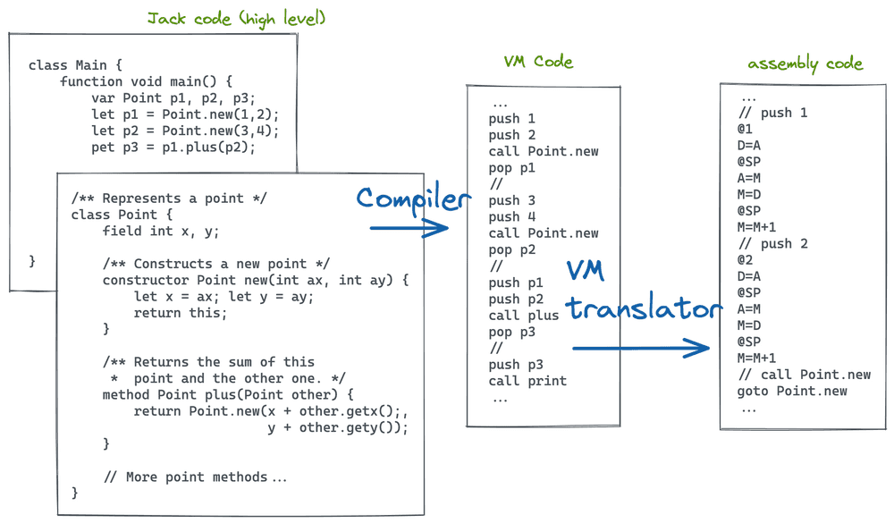
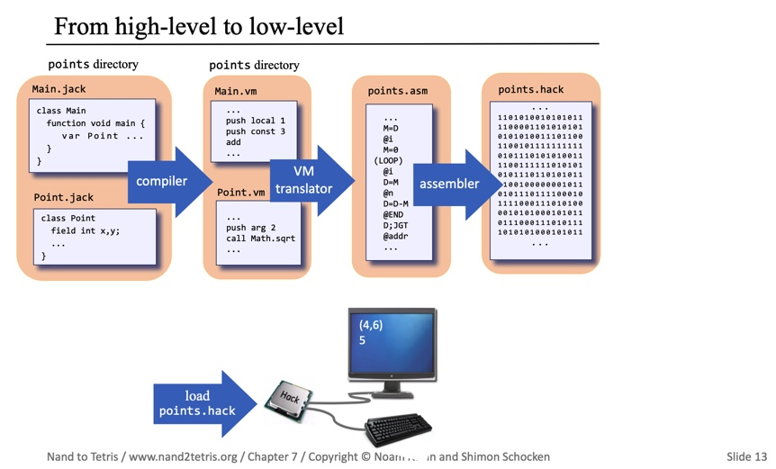

# VM Translator

This project implements a VM translator for the Hack computer platform, as part of the Nand2Tetris.

## Overview

The VM translator converts VM code (similar to Java bytecode) into Hack assembly language. It handles various VM commands including arithmetic operations, memory access, program flow, and function calls.

**This project is part of a longer study I undertook in 2022 to learn about how computers actually work at a deep level.** It's based on 
materials that show how to build a 16-bit computer from scratch, starting from logic gates and progressing through to a compiler and a very simple, basic operating system. **The goal is to gain a comprehensive understanding of how computer systems function at their most fundamental level.**

## Architecture

The VM translator follows a modular architecture, as illustrated in the diagram below:



This architecture breaks down the translation process into distinct components, each handling specific aspects of the VM-to-Assembly conversion:

1. **VMTranslator**: The main driver of the translation process.
2. **PushPopHandler**: Manages push and pop operations for various memory segments.
3. **ArithmeticHandler**: Handles arithmetic and logical operations.
4. **BranchingHandler**: Manages program flow commands (label, goto, if-goto).
5. **FunctionHandler**: Handles function-related commands (function, call, return).

This modular design enhances maintainability and allows for easier extension of functionality.

## High-Level Overview

To provide a better understanding of how this VM translator fits into the broader context of computer systems, consider the following high-level overview:



This image illustrates the complete process of converting high-level programming languages into binary code that a computer can execute. The VM translator, which this project implements, is a crucial step in this process:

1. High-level language (e.g., Java, Python)
2. Compiler converts to VM code
3. VM translator (this project) converts VM code to assembly
4. Assembler converts assembly to binary machine code

Our VM translator bridges the gap between the abstract VM code and the more concrete assembly language, playing a vital role in the overall compilation and execution process.

## Key Components

- Main VM translator logic
- Handling of arithmetic and logical operations
- Memory segment access (local, argument, this, that, constant, static, temp, pointer)
- Program flow commands (label, goto, if-goto)
- Function calling commands (function, call, return)

## File Structure

The project includes several test files and VM code examples:

- StaticsTest: Tests static variable handling across different classes
- FibonacciElement: Computes Fibonacci numbers recursively
- NestedCall: Tests nested function calls
- FibonacciSeries: Generates Fibonacci series iteratively

## Usage

To use the VM translator:

1. Ensure you have the necessary runtime environment (likely Python, based on the `lang.txt` file).
2. Run the main script, providing the input VM files as arguments.

```
python3 VMTranslator.py path/to/vm/files
```

## Testing

The project includes various test files (.tst) and comparison files (.cmp) for verifying the correctness of the VM translator output.

## Key Files

- `StaticsTest.asm`: Assembly output for static variable tests
- `FibonacciElement.asm`: Assembly code for Fibonacci number computation
- `Main.vm`: VM code for the main Fibonacci function
- `Sys.vm`: VM code for system initialization

## Notes

- The translator implements the VM specification as described in the Nand2Tetris.
- Special attention is given to handling function calls, returns, and maintaining the stack frame.
- This project is part of a broader exploration into computer architecture and systems, providing hands-on experience with low-level computing concepts.

For more detailed information on specific components, refer to the individual code files and comments within.
